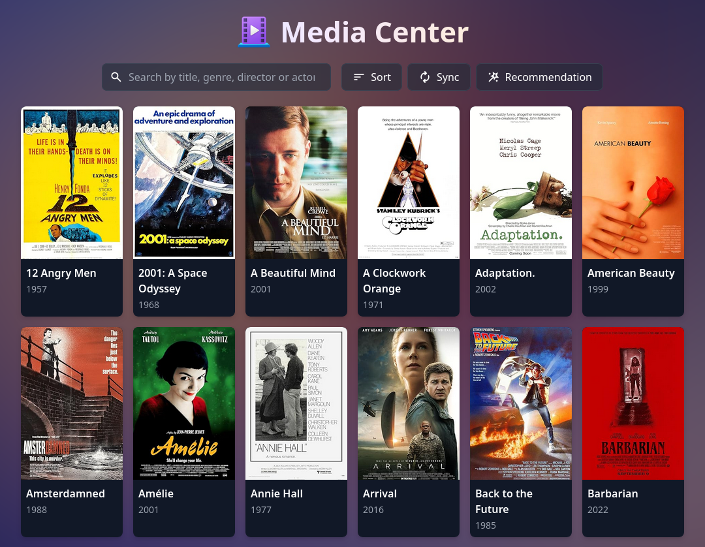

# Media Center

This project is a clean, locally hosted alternative to applications such as Plex and Jellyfin. It lets you stream content directly from your own server through WebDAV.

The project was originally developed for Windows and later adapted for Linux (tested on Ubuntu). Linux compatibility is verified, but the latest Windows configuration has not yet been revalidated.

This repository contains a media browser built with a FastAPI backend and a Nuxt frontend. It can automatically crawl video files from an ownCloud server (code can be adopted for other servers), organize them in a clean interface and leverage the playback power of MPV.

The project has been tested on Python 3.13 and Node 24 (for Nuxt).

## Screenshot

## Features

1. Scan a WebDAV media library and build a structured catalog  
2. Fetch posters and metadata from OMDb  
3. Serve media data to the frontend through HTTP JSON APIs  
4. Play videos with MPV on Windows and keep watch position in WebDAV

## Requirements

1. Python 3.13  
2. Node 18 or newer  
3. MPV installed for Linux or for Windows placed as backend/mpv.exe. Note that playback through the browser is not supported
4. A WebDAV server that hosts your media library (this project was tested on a ownCloud server)  
5. An OMDb API key

## Setup

### Configure environment variables

Create a file named .env in the project root in the backend folder. See `.env.example` for the structure.

### Configuring MPV
For Windows make sure you put MPV.exe inside the backend folder. 
For Linux (tested on Ubuntu) install MPV using `sudo apt install mpv`.

### Create and activate a virtual environment in backend

Linux (macOS not tested)

    cd backend
    python3.13 -m venv venv
    source .venv/bin/activate
    python -m pip install --upgrade pip
    python -m pip install -r requirements.txt

Windows cmd

    cd backend
    py -3.13 -m venv .venv
    .venv\Scripts\activate.bat
    python -m pip install --upgrade pip
    python -m pip install -r requirements.txt

Browse to http://localhost:50005/api/movies, this should show a JSON output.

### Creating the frontend environment

From the frontend folder

    npm install
    npm run build
    npm run start

Open the shown local address in your browser, you should get an empty interface.

### Running the application
You can auto start the backend and frontend using the provided `start.py` file in the root directory. You can also manually start the backend and frontend from each folder using `npm run start` in frontend directory and `uvicorn main:app --host 0.0.0.0 --port 50005 --reload` in backend folder.

## MPV Playback

1. When you press play in the UI the backend launches MPV with a WebDAV URL  
2. The app downloads any prior MPV watch position file for that URL  
3. While MPV is open the app uploads the latest position file at intervals
4. Various MPV lua scripts are loaded. These can be configured in `/backend/portable_config/scripts`

## Some useful tips

1. If OMDb lookups fail confirm that omdb_api_key is set in .env  
2. If posters are missing remove db_cache.json and run a manual sync  
3. If you move or delete media on the server the next sync will clean orphan poster files. The current sync schedule: the app checks whether it has been more than 7 days since the last sync every hour. A forced sync can also be started from the UI.

## Folder layout

    backend
      main.py
      crawler.py
      position_upload.py
      position_download.py
      mpv.exe            Windows only (this file is NOT provided)
    frontend
      nuxt.config.ts
      pages
      public
      server
    posters              created at runtime
    database.json        created at runtime
    db_cache.json        created at runtime
    last_sync.json       created at runtime

# Disclaimer and acceptable use

This project provides only the source code for a locally hosted media browser. It does not host, stream, or distribute any movies or other copyrighted material.
Users are solely responsible for the content stored on their servers and for ensuring they have the legal right to access or view it.
All movie titles, posters, and metadata shown in screenshots are for demonstration only.
Metadata and artwork are provided through the [OMDb API](https://www.omdbapi.com/legal.htm).